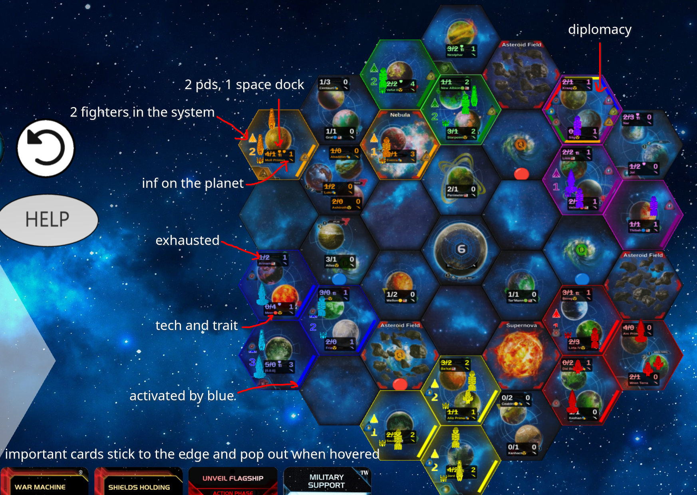

# TI4 UI Tweaks

This is a browser extension that provides a collection of tweaks to the Twilight Imperium 4th Edition UI.

Features

- Hex Tiles Update: The extension updates the hex tiles on the game board. This feature is implemented in the updateHexTiles() function in updateHexTiles.ts.
- Votes Display: The extension provides a visual representation of votes in the game. This feature is implemented in votes.ts.
- Cards Rendering: The extension renders the cards in the game. This feature is implemented in cardRenderer.ts.
  Installation

1. Clone the repository
2. Run yarn install to install the dependencies
3. Run yarn build to build the project
   Development

To watch the files for changes and automatically rebuild, run yarn watch.
Usage

After building the project, load the build directory as an unpacked extension in your browser.
Dependencies

This project uses the following dependencies:

- esbuild
- ti4calc
- typescript
- vite
- vite-plugin-copy
- vite-plugin-static-copy
  Contributing

Contributions are welcome. Please submit a pull request with your changes.
License

This project is licensed under the MIT License.
